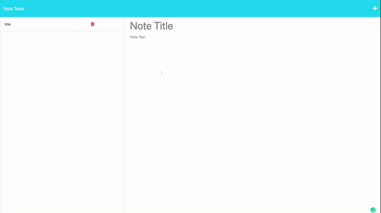

# noteTaker

## Description

This is an application that allows users to write and save notes so they can organize their thoughts and keep track of tasks they need to complete. This application will use an Express.js back end and will save and retrieve note data from a JSON file.

## Usage

When the page is loaded, the user is presented with a landing page with a link to a notes page/

When the user clicks on the link, the user is presented with a page with existing notes listed in the left-hand column, plus empty fields to enter a new note title and the note's text in the right-hand column.

When the user enters a new note, a Save icon appears in the navigation at the top right corner.

When the user clicks on the Save icon, the new note will be saved and will appear in the left-hand column.

When the user clicks on an existing note in the list, the note will appear on the right.

When the user clicks on the Plus icon at the top right corner, the empty fields for entering a new note will appear.

## Visual

## Links

Solution URL: [https://github.com/bettybowie/noteTaker]

Live URL: [https://notetaker-challenge11-app.herokuapp.com]

## License

MIT License
